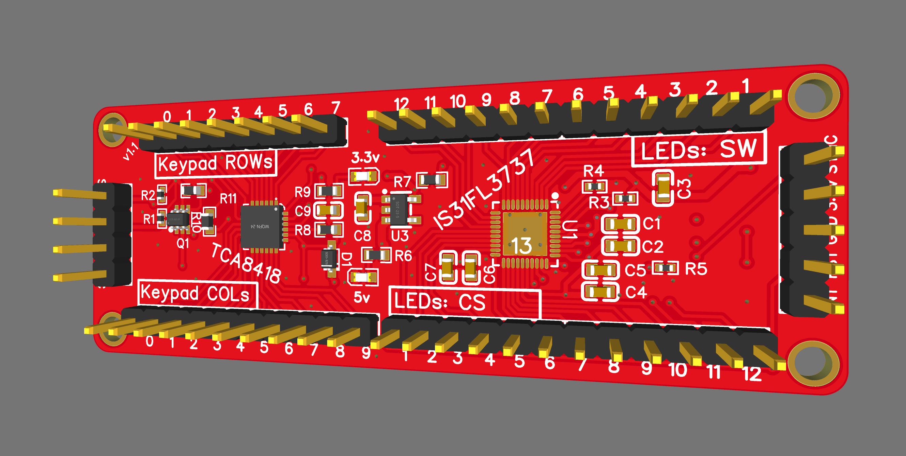
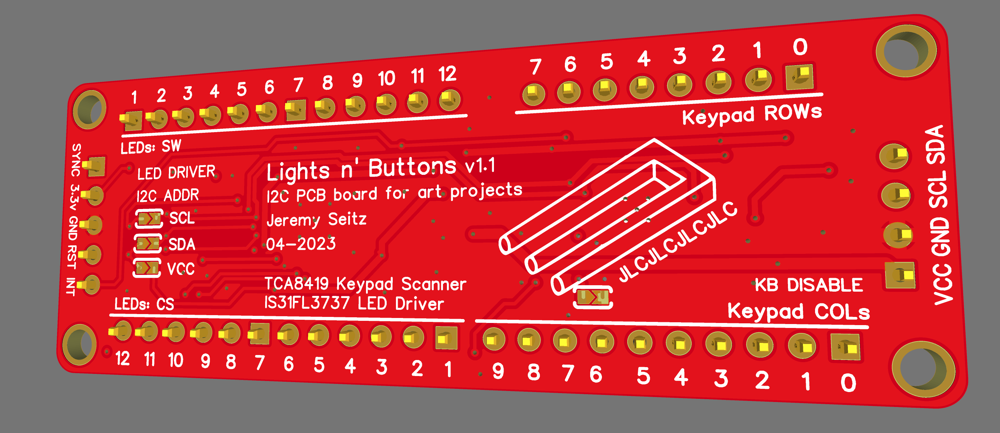
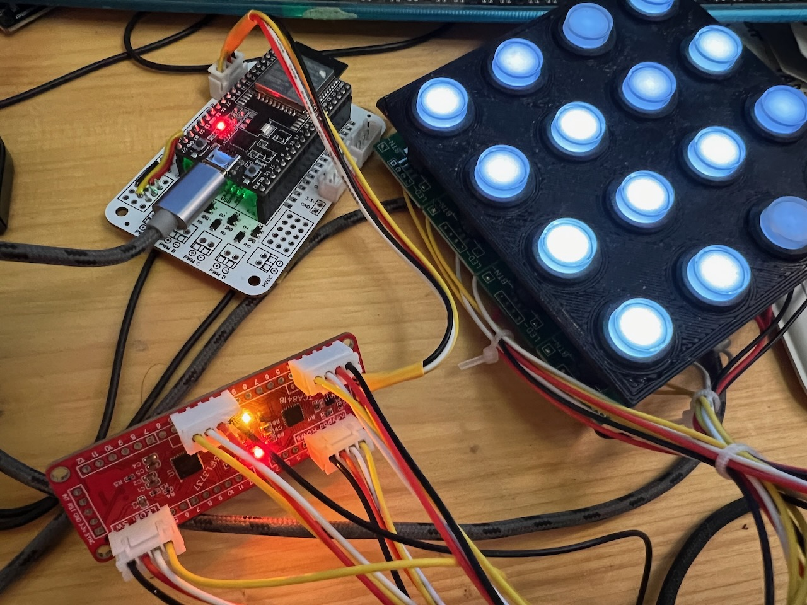
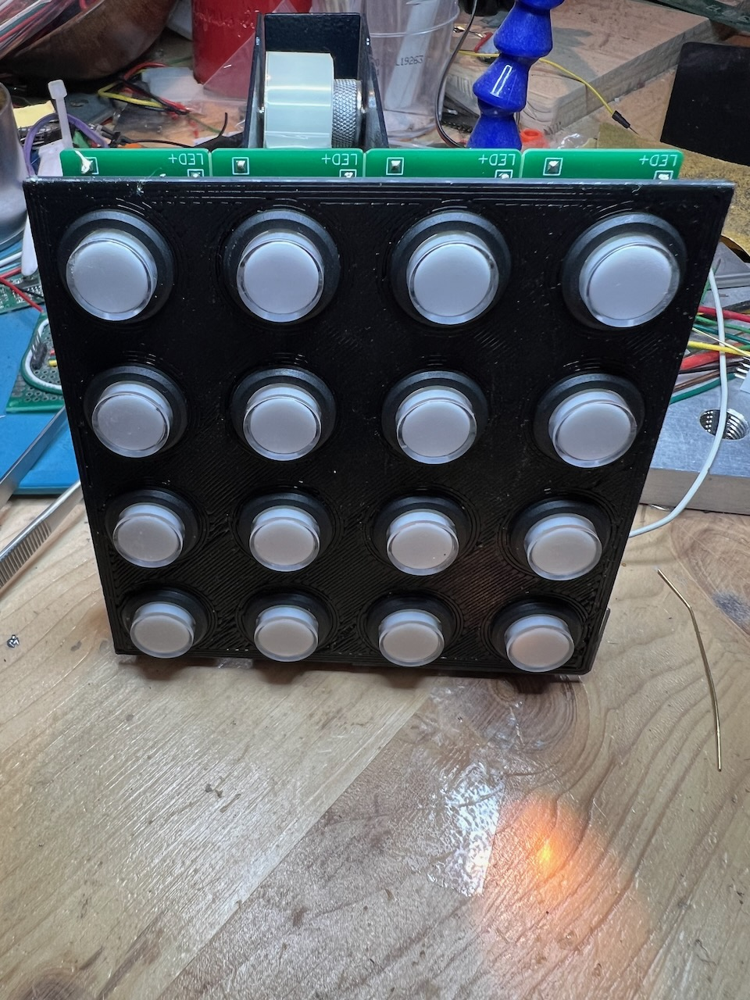
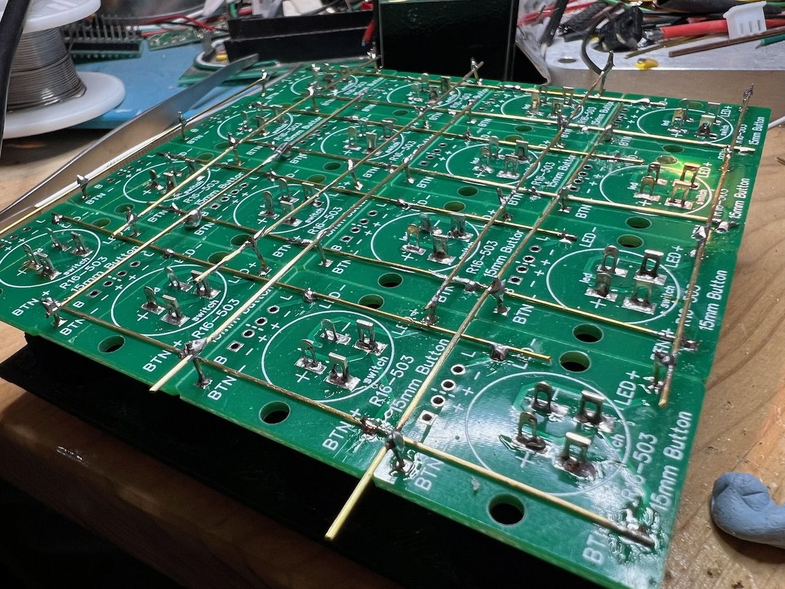
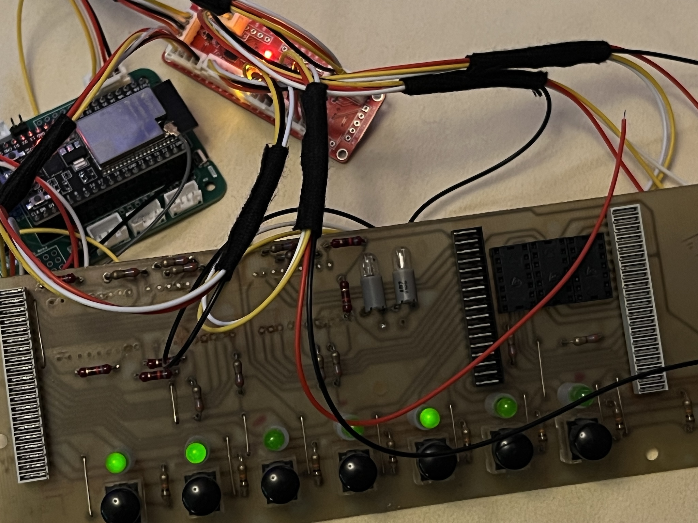

# Lights-and-Buttons

A small I2C breakout board for controlling lots of LEDs and buttons/switches.

It features two fabulous ICs on the same PCB:

- **TCA8418 keypad controller**: scans up to 80 separate contact points in an 8×10 matrix, with queuing and debouncing
- **IS31FL3737 LED driver**: controls a matrix of 144 (12×12) LEDs with 256 levels of individual dimming

**Demo Configuration**: This firmware is configured for 4×4 hardware (16 buttons + 16 LEDs) to match the example PCB.

Both I2C devices are present on the same board with configurable addresses via jumpers. Multiple boards can be connected to support more LEDs if desired.

This ESP32-based firmware demonstrates three operational modes: animated patterns, button-controlled effects, and hardware debugging.

## Hardware

- **ESP32** microcontroller with I2C communication
- **TCA8418** keypad controller (up to 8×10 button matrix)
- **IS31FL3737** LED driver (12×12 LED matrix with PWM dimming)
- Mode switching via GPIO button
- Onboard LED for diagnostics

## Features

The firmware demonstrates three operational modes:

- **ANIMATED**: Automatic position-dependent fade patterns across all LEDs
- **INTERACTIVE**: Button presses toggle corresponding LEDs on/off  
- **DEBUG**: Sequential LED testing with variable timing for hardware validation

Switch between modes using the mode button (GPIO 0). The onboard LED provides visual feedback for button presses and system errors.




## Project Background

I originally developed this project to create art projects and one-off fidget toys, making it easy to mock up interactive installations. It's also useful for miniatures and models - you can connect many LEDs without worrying about wiring resistors or adjusting brightness, as the LED driver handles all of that. Plus there are plenty of contacts for buttons.

This solution was inspired by [Adafruit's keypad controller breakout](https://www.adafruit.com/product/4918#description), and their open source driver is used in this example.

## Requirements

- **PlatformIO** development environment
- **ESP32** development board
- I2C connections to TCA8418 and IS31FL3737 chips

## Installation & Usage

1. Clone this repository
2. Open in PlatformIO
3. The firmware is pre-configured for 4×4 demo hardware (16 buttons + 16 LEDs). To modify for different hardware, update the configuration in `src/main.cpp`:

   ```cpp
   #define DEMO_LED_ROWS 4       // Demo hardware: 4 rows of LEDs
   #define DEMO_LED_COLS 4       // Demo hardware: 4 columns of LEDs
   #define DEMO_KEYPAD_ROWS 4    // Demo hardware: 4 rows of buttons
   #define DEMO_KEYPAD_COLS 4    // Demo hardware: 4 columns of buttons
   ```

4. Build and upload to ESP32
5. Use mode button (GPIO 0) to switch between demonstration modes

## Configuration

- **I2C Speed**: 800kHz (configurable in setup)
- **LED Driver Address**:
  - 0x50: IS31FL3737 Display (GND) ✅ default
  - 0x55: IS31FL3737 Display (SCL)
  - 0x5A: IS31FL3737 Display (SDA)
  - 0x5F: IS31FL3737 Display (VCC)
- **Keypad Address**: 0x34 (TCA8418 default)
- **Mode Button**: GPIO 0 with internal pullup
- **Status LED**: GPIO 2 for diagnostics

## Driver Documentation

- [IS31FL373x LED Driver](https://github.com/somebox/IS31FL373x-Driver) - Complete API and hardware reference
- [Adafruit TCA8418 Driver](https://github.com/adafruit/Adafruit_TCA8418) - Keypad controller breakout and library

Adafruit also makes a nice [keypad breakout board](https://www.adafruit.com/product/4918) that is compatible with this firmware.

## Example Hardware

### 4x4 Button Board

The test setup uses standard 16mm LED buttons ([search for "R16-503"](https://www.google.com/search?q=site%3Aaliexpress.com+R16-503)) which have four contacts (button+LED). I made a small PCB for them and soldered copper rods to the columns and rows of each, forming a 4×4 matrix. The edges of each side were then wired to JST cables for connection to the board. The ESP32 pictured is connected to a small breakout board to make the I2C cabling easier.





### Radio Tuner Retrofit

Work in progress: Hijacking the buttons and leds of an old radio tuner to use the panel to control an internet streaming music server.


